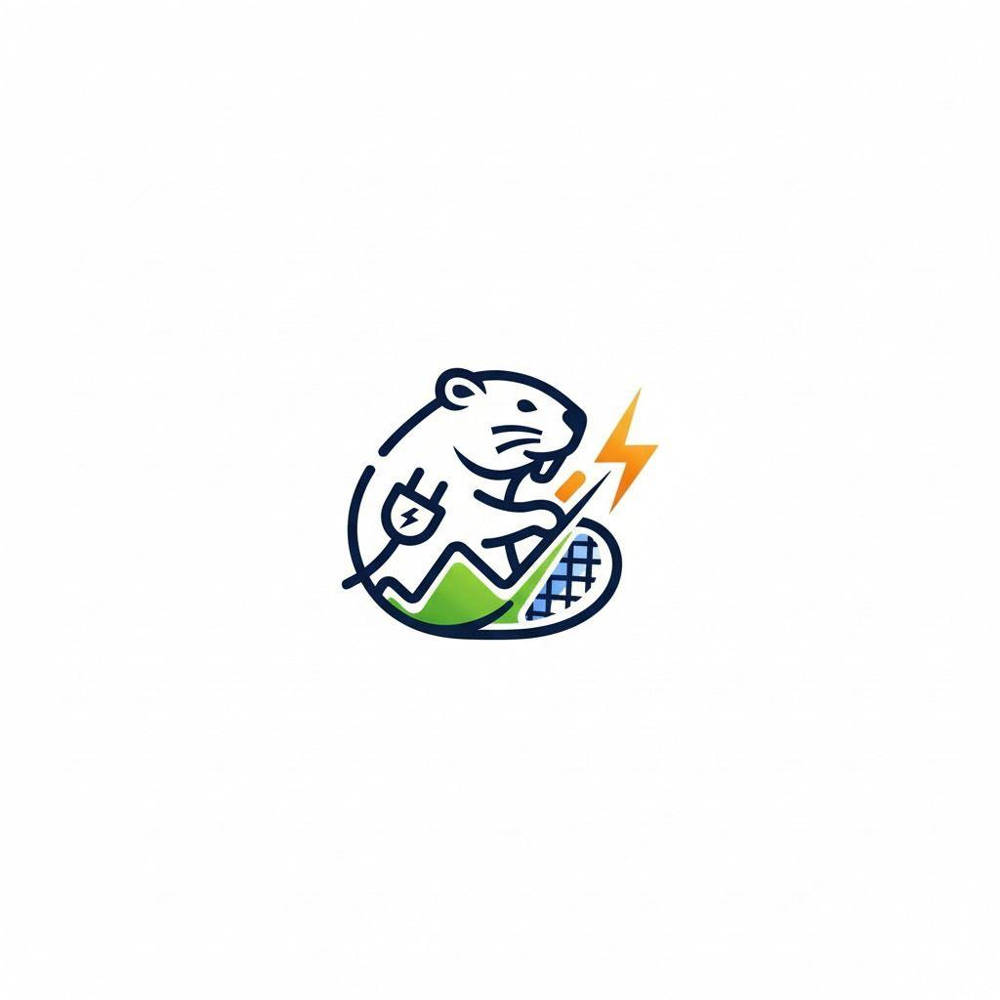

<div align="center">



# WattBeaver

### Monitoreo inteligente de energía y agua con gamificación

[](https://flutter.dev)
[](https://dart.dev)
[](https://mqtt.org)
[](LICENSE)
[](pubspec.yaml)

</div>

---

## ¿Qué es WattBeaver?

WattBeaver es una app móvil IoT que conecta dispositivos **ESP32** a tu hogar para monitorear en tiempo real el consumo de **energía eléctrica** y **agua**. Va más allá de los números: convierte el ahorro en un juego con rachas, logros, retos y un leaderboard global para que ahorrar sea adictivo.

```
📡 ESP32  →  MQTT Broker  →  Backend API  →  WattBeaver App
              (tiempo real)    (histórico)      (tú y tu racha)
```

---

## Características principales

### Energía & Agua en tiempo real
- **Lectura MQTT en vivo** — potencia (W), voltaje, corriente, flujo de agua
- **Historial por período** — día, semana, mes y año con gráficas interactivas
- **Detalle por hora** — toca cualquier día de la semana para ver su comportamiento horario
- **Vista inteligente** — muestra W cuando el consumo diario es < 1 Wh, kWh el resto del tiempo

### Gamificación
- **Puntos & Niveles** — 10 niveles con umbrales progresivos (100 → 300 → 600 → 1 000 … pts)
- **Rachas animadas** — flamita que crece de amarillo a púrpura (energía) / gotita de agua que crece de azul claro a marino (agua)
- **Logros** — colección de insignias con progreso y categorías
- **Retos activos** — misiones con barra de progreso y cuenta regresiva
- **Leaderboard** — ranking global de usuarios con puntos, nivel y racha actual

### Gestión de dispositivos
- **Vinculación ESP32** — flujo de provisión paso a paso
- **Estado en línea / fuera de línea** — basado en timestamp de última lectura (ventana de 5 min)
- **Búsqueda y filtro** — por tipo (energía / agua)
- **Rotación de API Key** — seguridad de dispositivo desde la app

### Alertas
- **Niveles de severidad** — crítico, advertencia, informativo
- **Reconocimiento y resolución** — directamente desde la app
- **Filtro por tipo** — acceso rápido a lo que importa

---

## Stack técnico

| Capa | Tecnología |
|------|-----------|
| UI | Flutter 3, Material Design 3, glassmorphism custom |
| Estado | Provider (`ChangeNotifier`) |
| Tiempo real | MQTT (`mqtt_client`) |
| HTTP | `http` con Bearer JWT |
| Gráficas | `fl_chart` |
| Almacenamiento local | `shared_preferences` |
| Auth | JWT (`jwt_decoder`) |
| Fuentes | Google Fonts |
| Íconos | FontAwesome Flutter |
| Animaciones | `AnimationController` custom (sin Lottie) |

---

## Estructura del proyecto

```
lib/
├── core/
│   ├── constants/      # app_colors.dart · api_constants.dart · mqtt_topics.dart
│   ├── theme/          # app_theme.dart · text_styles.dart · dimensions.dart
│   └── utils/          # validators · date_formatter · number_formatter
│
├── models/             # User · Device · EnergySummary · WaterSummary
│                       # EnergyWeek · WaterWeek · Gamification
│                       # Achievement · Challenge · LeaderboardData · Alert
│
├── services/
│   ├── api/            # api_service.dart (base) + auth/energy/water/
│   │                   # device/alerts/gamification/reports _api.dart
│   ├── mqtt/           # mqtt_service.dart · mqtt_handler.dart
│   └── storage/        # storage_service.dart (SharedPreferences)
│
├── providers/          # auth · dashboard · energy · water
│                       # devices · gamification · alerts · reports
│
├── screens/
│   ├── splash/         # Splash con check de auth + onboarding
│   ├── auth/           # Login · Register
│   ├── onboarding/     # 5 slides con animaciones
│   ├── dashboard/      # Home con MQTT live + widgets
│   ├── energy/         # Historial + selector de período/día
│   ├── water/          # Ídem para agua
│   ├── devices/        # Lista · Detalle · Añadir · Provisión
│   ├── gamification/   # Logros · Retos · Leaderboard
│   ├── alerts/         # Lista con filtros + reconocimiento
│   ├── reports/        # Resúmenes diario/semanal/mensual
│   └── profile/        # Perfil · Configuración
│
└── widgets/
    ├── common/         # CustomButton · CustomTextField · StatCard · LoadingWidget
    ├── cards/          # GlassCard
    └── charts/         # FlameWidget · WaterDropWidget · ActivityRing
```

---

## Backend & Endpoints

**Base URL:** `http://100.69.129.83:3000/api/v1`

```
POST  /auth/login                           → token + perfil de usuario
POST  /auth/register
GET   /auth/profile

GET   /energy/total                         → potencia/energía actual
GET   /energy/history?period=day|week|...   → histórico agrupado
GET   /energy/statistics/weekly?startDate=&endDate=

GET   /water/total
GET   /water/history?period=...
GET   /water/statistics/weekly?startDate=&endDate=

GET   /devices
POST  /devices/link
DELETE /devices/:id

GET   /alerts?acknowledged=false&limit=50
POST  /alerts/:id/acknowledge

GET   /gamification/profile
GET   /gamification/achievements
GET   /gamification/challenges
GET   /gamification/leaderboard
```

### MQTT

| Campo | Valor |
|-------|-------|
| Broker | `100.69.129.83:1883` |
| Credenciales | `backend_user` / `backend_password` |
| Topic energía | `wattnbeaber/energy/{device_id}/data` |
| Topic agua | `wattnbeaber/water/{sensor_id}/data` |
| Payload energía | `{ power, voltage, current, energy, timestamp }` |
| Payload agua | `{ flow, total, timestamp }` |

> **Nota:** el prefijo `wattnbeaber` tiene un typo heredado del firmware del ESP32; se usa tal cual en toda la app.

---

## Paleta de colores

| Rol | Color | Hex |
|-----|-------|-----|
| Energía (principal) | Menta medio | `#52BF90` |
| Energía (suave) | Menta claro | `#A8F0D0` |
| Agua (principal) | Cielo medio | `#4AB8E0` |
| Agua (profundo) | Water dark | `#2C84A8` |
| Gamificación | Lavanda medio | `#9B79FF` |
| Alerta crítica | Coral intenso | `#FF6B4A` |
| Fondo claro | Crema | `#ECE0D1` |
| Texto primario | Café oscuro | `#38220F` |

---

## Cómo correr el proyecto

### Requisitos

- Flutter 3.x (`flutter --version`)
- Dart 3.x
- Un backend WattBeaver corriendo (ver [wattnbeaver-backend](https://github.com/Chava33165/wattnbeaver-backend))
- Un broker MQTT accesible

### Instalación

```bash
# Clona el repo
git clone https://github.com/Chava33165/wattnbeaver-app.git
cd wattnbeaver-app

# Instala dependencias
flutter pub get

# iOS (si aplica)
cd ios && pod install && cd ..

# Corre en modo debug
flutter run
```

### Configura el backend

Edita `lib/core/constants/api_constants.dart` y `lib/core/constants/mqtt_topics.dart` con la IP y credenciales de tu servidor si son diferentes a las default.

---

## Flujo de navegación

```
Splash
  ├── Sin token / token expirado  →  Login / Register
  ├── Primera vez                 →  Onboarding (5 slides)  →  Dashboard
  └── Ya autenticado              →  Dashboard
          │
          ├── 🏠 Home      — Resumen live (MQTT) + gamificación + alertas
          ├── ⚡ Energía   — Historial + gráfica + selector día/semana/mes/año
          ├── 💧 Agua      — Ídem
          ├── 📡 Devices   — Gestión de ESP32
          └── 👤 Perfil    — Stats + configuración + logout
```

---

## Gamificación en detalle

### Niveles

| Nivel | Puntos acumulados |
|-------|------------------|
| 1 | 0 |
| 2 | 100 |
| 3 | 300 |
| 4 | 600 |
| 5 | 1 000 |
| 6 | 1 500 |
| 7 | 2 100 |
| 8 | 2 800 |
| 9 | 3 600 |
| 10 | 4 500 |

### Racha de energía — FlameWidget

| Días | Color | Mensaje |
|------|-------|---------|
| 1–3 | Amarillo | ¡Buen comienzo! |
| 4–6 | Naranja | ¡Vas muy bien! |
| 7+ | Púrpura | ¡Leyenda! |

### Racha de agua — WaterDropWidget

| Días | Color | Mensaje |
|------|-------|---------|
| 1–3 | Azul claro | ¡Empezando! |
| 4–6 | Azul medio | ¡Constante! |
| 7+ | Azul marino | ¡Maestro del ahorro! |

---

## Contribuir

1. Haz fork del repo
2. Crea tu rama: `git checkout -b feat/mi-feature`
3. Commitea tus cambios siguiendo [Conventional Commits](https://www.conventionalcommits.org/es/v1.0.0/)
4. Abre un Pull Request describiendo qué cambiaste y por qué

---

<div align="center">

Hecho con 💚 por el equipo **WATT**

*WattBeaver — Porque ahorrar energía también puede ser adictivo.*

</div>
